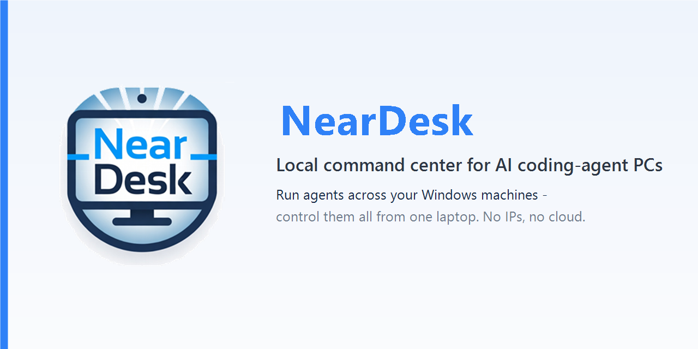
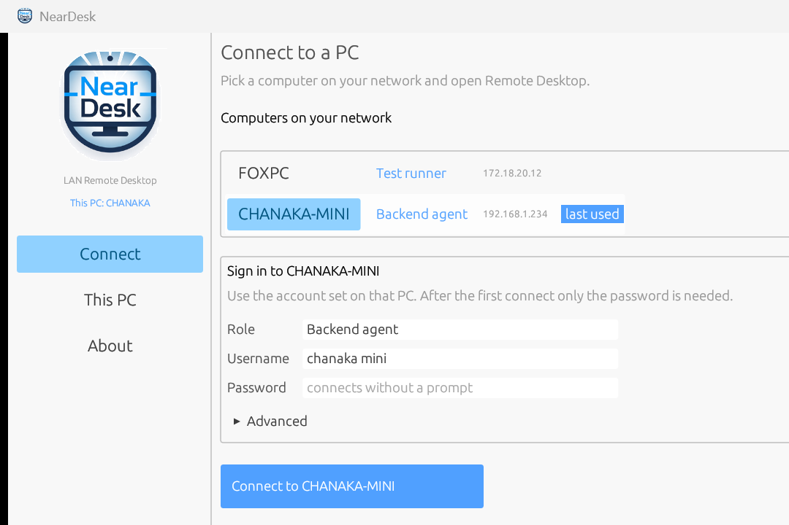
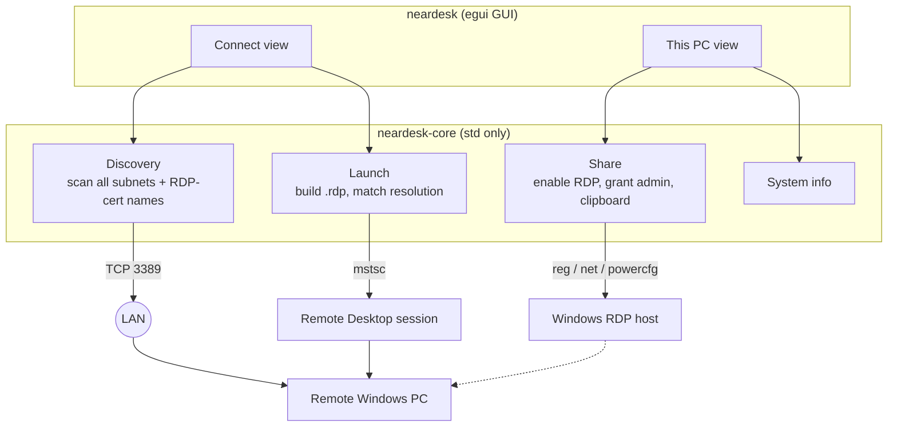

<p align="center">
  
</p>

<p align="center">
  <a href="https://github.com/chanakanakandala/neardesk/actions/workflows/ci.yml"></a>
  <a href="https://github.com/chanakanakandala/neardesk/releases/latest"></a>
  <a href="LICENSE"></a>
  <a href="https://github.com/chanakanakandala/neardesk/releases"></a>
  
  
</p>

**Run AI coding agents across your Windows PCs, all from one laptop.**

NearDesk turns the spare Windows machines on your network into dedicated workers
for AI coding agents. Think of a mini PC, an old desktop, or a build box sitting
idle. Run Claude Code, Codex, Cursor, or Copilot on each one, then reach any of
them from your laptop in a single click. There are no IP addresses to remember, no
cloud, and no accounts. It is just native Windows Remote Desktop.

```
Laptop              control center
  ├─ Mini PC 1      Backend agent      (Claude Code / Codex)
  ├─ Mini PC 2      Frontend agent     (Cursor / Copilot)
  ├─ Mini PC 3      Tests and builds
  └─ Spare PC       Sandbox / experiments
```

NearDesk finds your machines by name, lets you label each one with a **role**, and
connects instantly. A pile of headless PCs becomes one tidy board you drive from
your desk.

<p align="center">
  <a href="https://github.com/chanakanakandala/neardesk/releases/latest"><b>⬇&nbsp; Download the latest Windows release</b></a>
</p>

> **Status: early but useful.** NearDesk already does the hard part well, with
> zero-config discovery, per-machine roles, and one-click native RDP. Task and
> workspace orchestration is on the [roadmap](#roadmap). NearDesk manages the
> machines your agents run on; it does not replace the agents.

## Demo

<p align="center">
  
</p>

Open NearDesk and it **auto-discovers** your machines by role and name. Pick one,
press **Connect**, and a native Remote Desktop session opens at your display's
resolution.

## Why run agents on separate machines?

A single laptop cannot comfortably run every agent, build, test suite, and browser
session at once. They fight for CPU, RAM, disk, and your attention. Giving each job
its own machine is the obvious fix. The hard part is managing a pile of headless
PCs by IP address, and that is what NearDesk removes.

| Machine | Job |
|---------|-----|
| **Laptop** | Your command center, for orchestrating and reviewing. |
| **Mini PC** | A long-running backend refactor. |
| **Spare PC** | Frontend work, in parallel. |
| **Build box** | Tests, builds, and CI-style runs. |
| **Sandbox** | Risky experiments, kept isolated. |

Label each machine once, then reconnect in a click. Your laptop stays fast and free
for the task you are actually driving. It also works just as well for the plain
case: *"I just want to remote into my mini PC without remembering its IP."*

## Security model

NearDesk does **not** implement its own remote-desktop protocol, and it never
routes your traffic through a server.

- It uses **Windows' built-in Remote Desktop** (`mstsc`) with **Network Level
  Authentication required**.
- **No cloud, no account, no background service.** Authentication is handled
  entirely by Windows.
- NearDesk never **stores or proxies** your password.
- Discovery is read-only. It only checks the Remote Desktop port on devices on
  **your local network**.

> Releases are not code-signed yet, so Windows SmartScreen may warn on first run.
> Choose **More info → Run anyway**, or [build from source](#getting-started).

## Platforms

NearDesk targets **Windows, macOS, and Linux** and connects any-to-any using each
OS's native remote-desktop stack. No single protocol hosts on all three, so
NearDesk is protocol-aware: discovery scans for both and labels every machine
**RDP** or **VNC**.

| Connecting to a host on... | Protocol | Client launched |
|---|---|---|
| **Windows** / **Linux** | RDP (3389) | `mstsc`, FreeRDP, Remmina, or macOS `rdp://` |
| **macOS** | VNC (5900) | macOS Screen Sharing, Remmina (Windows viewer soon) |

Windows is fully supported (connect plus one-click sharing). **macOS and Linux are
new:** connecting works today by launching the native client; hosting is guided
(macOS requires a one-time Screen Recording approval that Apple mandates). See the
[Roadmap](#roadmap).

## One app, three tabs

| Tab | What it does |
|-----|--------------|
| **Connect** | Your machine board. Windows PCs discovered by **role** and name. Pick one and open Remote Desktop; the role, username, and credential are remembered per machine. |
| **This PC** | How this machine looks on the network (name, signed-in user, **Windows edition and build**, architecture, IP, and Remote Desktop status), plus one-click sharing (self-elevates via UAC). |
| **About** | What NearDesk is for, version, and credits. |

The same `neardesk.exe` runs on both ends, with nothing else to install.

## How discovery works

1. **By name.** It resolves `OFFICE-PC`, then `OFFICE-PC.local` (mDNS), and checks
   the Remote Desktop port is open.
2. **By scan.** In parallel it probes every host on each network you are attached
   to (Wi-Fi, Ethernet, VPN) for an open RDP port (3389), then reads each host's
   real name from its RDP certificate. The last-used PC is auto-selected.

## Architecture



The same `neardesk.exe` plays both roles. **This PC** configures the local machine
as an RDP host; **Connect** discovers and opens sessions to others.

## Getting started

### 1. Install

Grab the build for your OS from the
[latest release](https://github.com/chanakanakandala/neardesk/releases/latest):

- **Windows** — `neardesk.exe`, just run it.
- **macOS** — `neardesk-macos.tar.gz`; unzip, then clear the quarantine flag and open
  it: `xattr -dr com.apple.quarantine NearDesk.app && open NearDesk.app`. To connect
  to an RDP host, install FreeRDP: `brew install freerdp`.
- **Linux** — `neardesk-linux.tar.gz`; install a client to connect, e.g.
  `sudo apt install -y freerdp3-x11 remmina remmina-plugin-vnc`.

**Or build from source** with the [Rust toolchain](https://rustup.rs) — plus the
**MSVC C++ Build Tools** on Windows, or X11/GTK/ALSA dev headers on Linux:

```sh
cd neardesk
cargo build --release
```

### 2. Share the PC you want to reach

On that PC, open **This PC**, then **Turn on remote access** (approve the UAC
prompt). It enables Remote Desktop, grants your Windows account access, and shows
the computer name. You connect with your **normal Windows password**, with nothing
extra to set.

> The host PC must be Windows **Pro/Enterprise** (required to host RDP). The PC you
> connect *from* can be any Windows.

### 3. Connect from another PC

Open NearDesk on your laptop and it auto-discovers PCs on the network. Pick yours,
enter its Windows password, and press **Connect**. It is remembered afterwards, so
the next time is one silent click.

## Configuration

Settings are remembered next to `neardesk.exe` in a plain `neardesk.conf`
(`key=value`). Delete it to reset. NearDesk never stores passwords; authentication
is left entirely to Windows.

## Project layout

```
neardesk/
├─ core/            # neardesk-core: discovery + protocol detection (portable)
│  └─ src/platform/ # per-OS backends: windows.rs, macos.rs, linux.rs
├─ app/             # neardesk GUI
│  ├─ build.rs      # embeds version metadata, manifest and icon
│  └─ src/
│     ├─ main.rs    # window shell + sidebar navigation
│     ├─ connect.rs # the "Connect" tab
│     ├─ this_pc.rs # the "This PC" tab
│     ├─ about.rs   # the "About" tab
│     ├─ logo.rs    # embedded logo (icon + texture)
│     └─ widgets.rs # shared UI helpers + palette
├─ assets/          # logo, icon, banner, screenshots
├─ build.ps1        # release build (-Clean / -Run)
├─ run.ps1          # build + launch
└─ check.ps1        # fmt + clippy lint gate
```

The `core` crate is intentionally dependency-free `std`; only the GUI pulls in
`eframe`. Keep it that way when contributing.

## Roadmap

NearDesk is the control layer today; the goal is a lightweight local agent
workspace. Planned, roughly in order:

- **macOS / Linux hosting:** guided Screen Sharing (macOS) and xrdp/GNOME (Linux), plus a bundled VNC viewer so Windows can reach a Mac.
- **Status notes:** a quick line per machine (*running backend refactor*, *idle*, *blocked*).
- **Quick actions:** copy hostname or RDP command, open a shared folder.
- **Health at a glance:** online or offline, and RDP-reachable.
- **Agent board:** roles and status in one view.

Issues and ideas welcome.

## Contributing

Issues and PRs welcome. Run `./check.ps1` (formatting and clippy) before
submitting. OS-specific code lives behind `core/src/platform/{windows,macos,linux}.rs`;
keep everything else OS-agnostic.

| Script | What it does |
|--------|--------------|
| `./build.ps1` | Release build. `-Clean` for a fresh build, `-Run` to launch after. |
| `./run.ps1` | Build and launch in one step. |
| `./check.ps1` | Formatting check and clippy (warnings denied). |

If NearDesk is useful to you, a ⭐ helps other mini-PC and homelab users find it.

## License

[MIT](LICENSE) © 2026 NearDesk contributors
