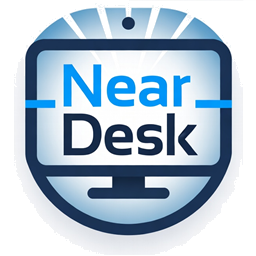

<p align="center">
  
</p>

<h1 align="center">NearDesk</h1>

<p align="center">
  <a href="https://github.com/chanakanakandala/neardesk/actions/workflows/ci.yml"></a>
  <a href="https://github.com/chanakanakandala/neardesk/releases/latest"></a>
  <a href="LICENSE"></a>
  <a href="https://github.com/chanakanakandala/neardesk/releases"></a>
  
  
</p>

**Zero-config Remote Desktop for your LAN.** Run one small app on any Windows PC.
On the PC you want to reach, flip on sharing with a single click; from another PC,
NearDesk finds it on the network by name (or by scanning for the Remote Desktop
port) and opens the session for you.

One app, no servers, no accounts, no cloud. Native Windows RDP under the hood, so
the picture is sharp and the latency is low.

Built in Rust with [`egui`](https://github.com/emilk/egui) · MIT licensed.

---

## Why NearDesk?

A lot of development now runs through AI coding agents — Claude Code, OpenAI Codex,
GitHub Copilot CLI, and others. They work best when each one runs **where its task
belongs**, instead of everything piling onto the single laptop in front of you:

- a spare **mini PC** grinding through a long refactor,
- a **build server** running the full test suite,
- a **GPU box** handling model work,
- your **main workstation** kept free for whatever you're actively driving.

To work like this you need to jump onto those machines quickly — start an agent,
watch it, steer it, review the diff — then move on to the next one. NearDesk makes
that a one-click move: it finds the Windows machines on your LAN and drops you
straight into a full Remote Desktop session. Delegating a task to the right agent
on the right box becomes as easy as switching tabs.

## One app, three tabs

| Tab | What it does |
|-----|--------------|
| **Connect** | Find another Windows PC on your network and open Remote Desktop. Type a name, or just press **Discover** to scan the subnet. |
| **This PC** | See how this machine looks on the network — name, signed-in user, **Windows edition & build**, architecture, IP, and Remote Desktop status — and enable sharing in one click (self-elevates via UAC). |
| **About** | What NearDesk is for, version, and credits. |

The same `neardesk.exe` runs on both ends — there's nothing else to install.

## How discovery works

1. **By name** — resolves `OFFICE-PC`, then `OFFICE-PC.local` (mDNS), and checks the
   Remote Desktop port is open.
2. **By scan** — in parallel it probes every host on your `/24` subnet for an open
   RDP port (3389). If the name resolves to one of those hosts, that's your match;
   if only one host answers, it is selected automatically; otherwise you pick from
   the list.

## Quick start

### 1. Prerequisites

- Two or more Windows PCs on the same LAN.
- The PC you connect **to** must be Windows **Pro/Enterprise** (required to host RDP).
- The PC you connect **from** can be any Windows (the `mstsc` client is built in).
- **To build from source:** the [Rust toolchain](https://rustup.rs) and the
  **MSVC C++ Build Tools** (`link.exe`). If you don't have them:

  ```sh
  winget install Rustlang.Rustup
  winget install Microsoft.VisualStudio.2022.BuildTools `
    --override "--quiet --add Microsoft.VisualStudio.Workload.VCTools --includeRecommended"
  ```

### 2. Build

```sh
cd neardesk
cargo build --release          # or:  ./build.ps1
```

The binary lands at `target/release/neardesk.exe`.

Helper scripts (PowerShell):

| Script | What it does |
|--------|--------------|
| `./build.ps1` | Release build. `-Clean` for a fresh build, `-Run` to launch after. |
| `./run.ps1` | Build and launch in one step. |
| `./check.ps1` | Formatting check + clippy (warnings denied) — the contributor lint gate. |

### 3. Share the PC you want to reach

Run `neardesk.exe` on it, open the **This PC** tab, and click **Enable Remote
Desktop** (approve the UAC prompt). Note the computer name shown there.

### 4. Connect from another PC

Run `neardesk.exe`, stay on the **Connect** tab, enter that name, click
**Discover**, then **Connect**. Windows handles the username/password prompt on
first connect and can remember it.

## Configuration

Settings are remembered next to `neardesk.exe` in a plain `neardesk.conf`
(`key=value`). Delete it to reset. NearDesk never stores passwords —
authentication is left entirely to Windows.

## Project layout

```
neardesk/
├─ core/            # neardesk-core: discovery, system info, RDP setup (std-only, no deps)
├─ app/             # neardesk GUI
│  └─ src/
│     ├─ main.rs    # window shell + sidebar navigation
│     ├─ connect.rs # the "Connect" tab
│     ├─ this_pc.rs # the "This PC" tab
│     ├─ about.rs   # the "About" tab
│     ├─ logo.rs    # embedded logo (icon + texture)
│     └─ widgets.rs # shared UI helpers + palette
├─ assets/logo.png  # app icon / sidebar logo
├─ build.ps1        # release build (-Clean / -Run)
├─ run.ps1          # build + launch
└─ check.ps1        # fmt + clippy lint gate
```

The `core` crate is intentionally dependency-free `std`; only the GUI pulls in
`eframe`. Keep it that way when contributing.

## Security notes

- NearDesk enables Windows' own Remote Desktop with **Network Level
  Authentication required** — nothing weaker.
- Discovery is read-only TCP probing on your local subnet.
- No credentials are stored or transmitted by NearDesk itself.

## Contributing

Issues and PRs welcome. Run `./check.ps1` (formatting + clippy) before submitting,
and keep `core` free of third-party crates.

## License

[MIT](LICENSE) © 2026 NearDesk contributors
